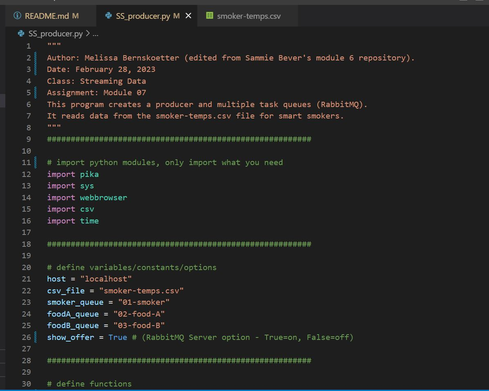
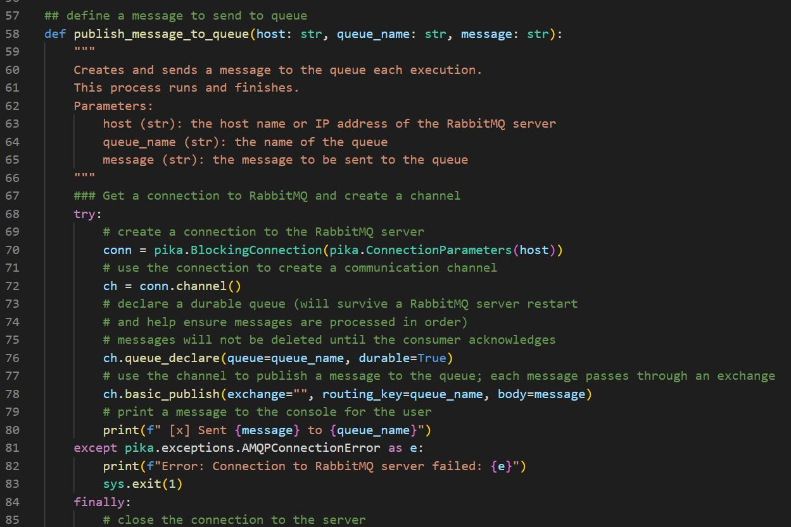
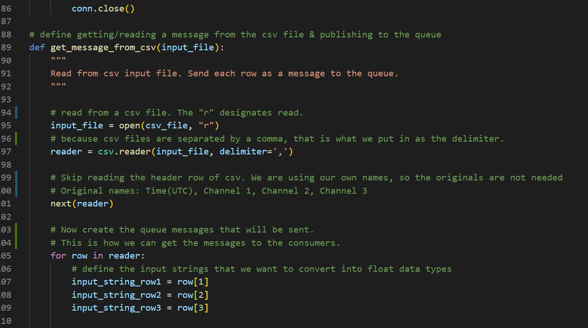
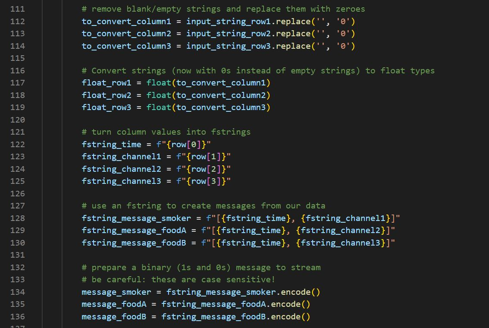
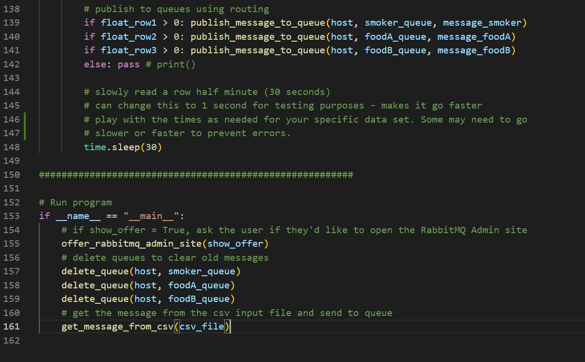

# A7-Streaming-Final
Module 7 final assignment, option 1. Will be re-making the smart smoker repository.
Author: Missy Bernskoetter
Date: February 28, 2023
I am using Sammie Bever's module 6 repository, which can be found here: 
https://github.com/s520250/streaming-06-smart-smoker ***you can also find the smoker-temps.csv here***
I chose this repository because I wanted to complete one with one sheet for all three consumers. 
I will be editing the code to match my files:
SS_producer.py
SS_Consumer.py
The smoker-temps.csv file is the one used for module 5 and 6 in Streaming Data (Spring 2023).
School: Northwest Missouri State University
Professor: Denise Case

To get files:
1. Go to the repository above.
2. At the same time, have your Github open.
3. Create a new repository for yourself (I named mine A7-Streaming-Final, but it is up to you).
4. Make sure the repository is public and the box is checked to add a README file.
5. Add 2 files to the repository, name them accordingly (I chose SS_producer and SS_Consumers)
   ***MAKE SURE YOU ADD .py TO THE END OF THE NAME!***
6. I then went into the producer file within the repository above and copied the code.
7. Following that I went into my own producer file and pasted the code. From there I made edits.
8. I then followed steps 6 and 7 for the consumer(s). Make sure edits are meaningful and necessary.
9. I also went into my previous repositories (you can use the file in the repository above) to get
   the 'smoker-temps.csv' file. I then pasted that into my repository.
10. Once I had all files, I started on the general instructions below:

General instructions:
1. Look over all files to ensure they have the data you need. 
2. Start with the producer file, editing the code to match what you need.
3. Once you have finished editing the producer, open a Anaconda (admin) terminal window.
4. Make sure the producer runs.
5. Open and begin editing the consumer(s).
6. Once you have finished editing the consumer(s), open 2 Anaconda (admin) terminal windows, and have
   the RabbitMQ queue website open (click y when prompted). I will have a picture below.
7. Start with the producer, running the file and making sure it is sending data.
8. Have the other window be the consumer(s) that will receive the data/messages.
9. Watch for errors, (temperature changes), and stalling.
10. Take screenshots of all  terminals open and running. 

*It may be helpful to take screenshots as you finish each section to show in your README file.
*I will have screenshots for each instruction. They will be below this introduction.
""" I am using VS Code to edit the codes and README file """
***BE SURE TO SAVE AS YOU GO AND COMMIT CHANGES TO AVOID LOSING ANY EDITS***

2. full code 

3.-4. RabbitMQ admin queue (once it opens, use username: guest and password: guest)

5. consumer code

6. terminal example (prior to codes running)
""" you need to cd your terminal to match the folder where your code is """
""" example: cd "C:\Users\15736\Documents\A7-Streaming-Final" """
""" all terminals will need to have a cd for the folder """

7. producer running

8. consumer(s) running

10. completed run

Terminal history will be saved in a file within this repository. One will be for the producer,
and one will be for the consumer(s). This is helpful to determine if there are errors with your
data and look over what was streamed. This will also allow you to see any stalls or termperature 
changes that were located during the stream.

***Be patient with this stream. It takes time to start showing food-A and food-B***
***Make notes in the README file with questions and concerns for further research***

