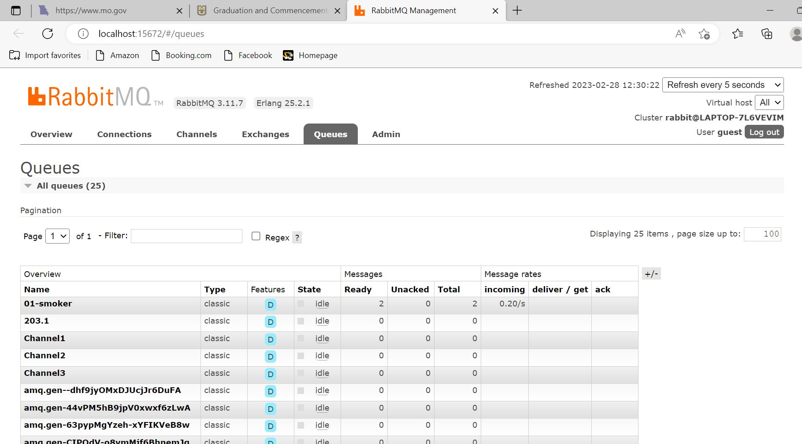
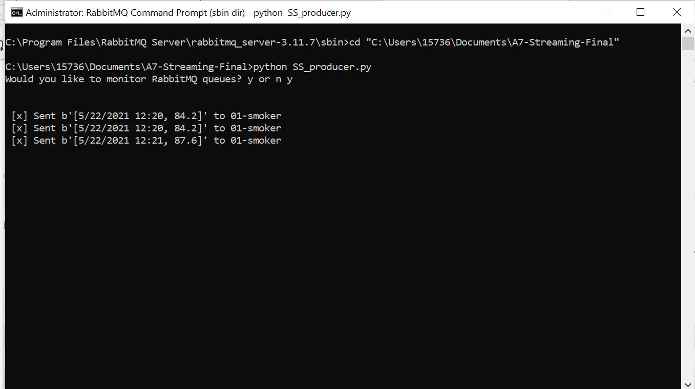

# A7-Streaming-Final
Module 7 final assignment, option 1. Will be re-making the smart smoker repository.
Author: Missy Bernskoetter
Date: February 28, 2023
I am using Sammie Bever's module 6 repository, which can be found here: 
https://github.com/s520250/streaming-06-smart-smoker 
I chose this repository because I wanted to complete one with one sheet for all three consumers. 
I will be editing the code to match my files:
SS_producer.py
SS_Consumer.py
SS_Consumer2.py
The smoker-temps.csv file is the one used for module 5 and 6 in Streaming Data (Spring 2023).
School: Northwest Missouri State University
Professor: Denise Case

General instructions:
1. Look over all files to ensure they have the data you need. 
2. Start with the producer file, editing the code to match what you need.
3. Once you have finished editing the producer, open a Anaconda (admin) terminal window.
4. Make sure the producer runs.
5. Open and begin editing the consumer(s).
6. Once you have finished editing the consumer(s), open 2 Anaconda (admin) terminal windows, and have
   the RabbitMQ queue website open (click y when prompted). I will have a picture below.
7. Start with the producer, running the file and making sure it is sending data.
8. Have the other window be the consumer(s) that will receive the data/messages.
9. Watch for errors, (temperature changes), and stalling.
10. Take screenshots of all  terminals open and running. 

*It may be helpful to take screenshots as you finish each section to show in your README file.
*I will have screenshots for each instruction. They will be below this introduction.
""" I am using VS Code to edit the codes and README file """
*** BE SURE TO SAVE AS YOU GO AND COMMIT CHANGES TO AVOID LOSING ANY EDITS ***

2. full code 

3.-4. RabbitMQ admin queue (once it opens, use username: guest and password: guest)
   RabbitMQ terminal running with producer
   
   

5. consumer code

6. terminal example (prior to codes running)
""" you need to cd your terminal to match the folder where your code is """
""" example: cd "C:\Users\15736\Documents\A7-Streaming-Final" """
""" all terminals will need to have a cd for the folder """

7. producer running
8. consumer(s) running
10. completed run